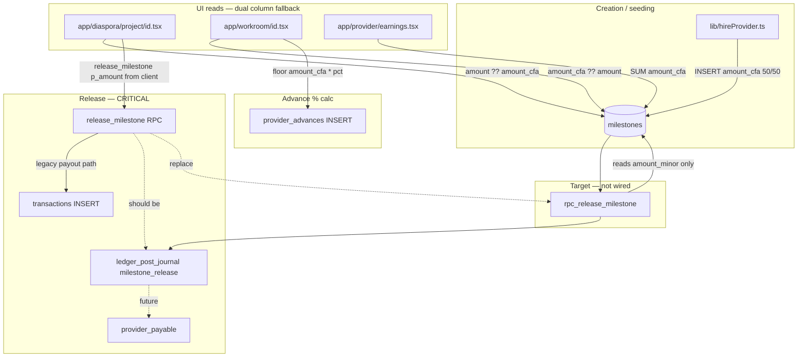

# Milestone Amount Dependency Map

```yaml
STATUS: HISTORICAL SNAPSHOT
SNAPSHOT: PRE-RELEASE-PATH-CHANGE (2026-09-02 morning)
SUPERSEDED FOR CURRENT STAGING STATE BY: docs/04_MASTER_RECONCILIATION_AND_EXECUTION_PLAN.md §J
NOTE: Release path no longer calls release_milestone RPC; see project/[id].tsx handleReleaseFunds
```

**Generated:** 2026-09-02  
**Purpose:** Trace every read/write path that depends on milestone monetary fields  
**Target state:** Single workflow amount (`milestones.amount_minor`) + ledger settlement on release (`rpc_release_milestone`)

---

## 1. Milestone amount fields (current)

| Column | Type | Schema source | Staging minimal | Authority |
|--------|------|---------------|-----------------|-----------|
| `amount` | `numeric` | `monopoly_ecosystem.sql` (legacy) | **Absent** | LEGACY — non-authoritative |
| `amount_cfa` | `numeric` | `monopoly_ecosystem.sql` (legacy) | **Absent** | LEGACY — non-authoritative |
| `amount_minor` | `bigint` | `20260902100000_phase5_canonical_money.sql` | **Absent** (until Phase 5 apply) | **Workflow contract** — authoritative for quoting; **not** proof of payment |
| `currency` | `char(3)` DEFAULT `'XAF'` | Phase 5 migration | **Absent** (until apply) | Metadata |

**Read precedence (when multiple populated):** `amount_minor` > `amount_cfa` > `amount`  
**Implementations:** `platform_resolve_amount_minor()` (SQL), `resolveAmountMinor()` (`lib/money.ts`)

---

## 2. Dependency graph



---

## 3. Write paths (who sets milestone amounts)

| # | Caller | File | Fields written | Trigger | Risk |
|---|--------|------|----------------|---------|------|
| W1 | Hire flow | `lib/hireProvider.ts` | `amount_cfa` (half budget split ×2) | Client accepts provider bid | Does not set `amount_minor`; dual-column drift |
| W2 | Milestone edit (if exposed) | RLS `milestones` UPDATE via `user_can_access_project` | `amount`, `amount_cfa` (possible) | Observer/provider/client with project access | Client can mutate contract amount |
| W3 | Release (incorrect) | `app/diaspora/project/[id].tsx` → `release_milestone` | Does not write milestone amount; passes **client `p_amount`** to RPC | Client taps release | **P0:** release amount ≠ milestone row |
| W4 | Target hire RPC | Future `rpc_seed_milestones` / `hireProvider` server-side | `amount_minor`, `currency` | Server-side hire | Required for canonical model |

---

## 4. Read paths (who consumes milestone amounts)

| # | Caller | File | Expression | Use case | Depends on |
|---|--------|------|------------|----------|------------|
| R1 | Project hub — milestone list | `app/diaspora/project/[id].tsx` | `Number(m.amount ?? m.amount_cfa ?? 0)` | Display milestone value | Dual columns |
| R2 | Project hub — payment prefill | `app/diaspora/project/[id].tsx` | `nextReleasableMilestone.amount ?? amount_cfa` | Prefill release/payment UI | Dual columns |
| R3 | Project hub — release RPC | `app/diaspora/project/[id].tsx` | Client-selected / prefilled amount → `p_amount` | **Funds release** | **Client input, not DB** |
| R4 | Workroom — milestone cards | `app/workroom/[id].tsx` | `item.amount_cfa ?? item.amount ?? 0` | Provider view of locked milestones | Dual columns |
| R5 | Workroom — advance percentage | `app/workroom/[id].tsx` | `floor(amount_cfa ?? amount) * pct/100` | Compute advance request | Dual columns |
| R6 | Earnings dashboard | `app/provider/earnings.tsx` | `SUM(m.amount_cfa)` where status filter | "Pending earnings" display | **`amount_cfa` only** — ignores `amount` |
| R7 | Diaspora progress (indirect) | `app/diaspora/index.tsx` | Uses `projects.budget`, not milestone sum | Progress bar | **Not milestone amount** — budget conflation |
| R8 | Legacy release RPC | `monopoly_ecosystem.sql` → `release_milestone` | Reads milestone for validation (partial); **`p_amount` from caller wins** | Payout | Client-supplied amount |
| R9 | Target release RPC | `01_CANONICAL_MODELS.md §3.3` → `rpc_release_milestone` | `milestone.amount_minor` only | Ledger posting | **Not implemented** |
| R10 | Ledger (future) | `ledger_lines.milestone_id` + journal | Amount from journal lines, not milestone column | Settlement audit | C7 |

---

## 5. Downstream dependencies (non-milestone but amount-coupled)

| System | Coupling to milestone amount | Field / path |
|--------|------------------------------|--------------|
| Provider advances | Advance = % of first locked milestone | `workroom/[id].tsx` reads milestone → writes `provider_advances.amount_cfa` |
| Material cart approval | Independent cart totals; shown beside milestones | `project/[id].tsx` — not milestone amount but same release UX |
| Warranty / retainage UI | `% of project` not per-milestone on UI | `projects.warranty_retainage_cfa` — should derive from final milestone + ledger |
| Insurance fee (future funding) | 1.5% of **payment** gross, not milestone | `payments.amount_xaf` / Phase 3B |
| Dispute freeze (future) | May freeze `frozen_amount_minor` tied to milestone | `disputes` model §6 — not wired |
| Evidence gate (future) | Release precondition, not amount source | `rpc_release_milestone` step 5+ |

---

## 6. Legacy RPC: `release_milestone`

**Source:** `supabase/migrations/monopoly_ecosystem.sql` (~line 195)  
**Signature (legacy):** `release_milestone(project_id, milestone_id, p_amount numeric, ...)`

| Step | Legacy behavior | Canonical replacement |
|------|-----------------|----------------------|
| Amount source | **`p_amount` from client** | Server reads `milestones.amount_minor` |
| Balance check | Project/milestone flags; **no ledger escrow check** | `project_escrow.balance_xaf >= amount_minor` |
| Idempotency | Weak / absent | `idempotency_key := 'ms_rel:' || milestone_id` |
| Money movement | `transactions` INSERT (legacy wallet) | `ledger_post_journal('milestone_release')` |
| Milestone state | Single `status` text → `'paid'` | Split workflow + financial state machines |
| Retainage | May touch `projects.retainage_balance` | Credit `project_retainage` ledger account |
| Dispute guard | Partial / `dispute_status` column | Open dispute check + compliance_hold |

**App call site:** `app/diaspora/project/[id].tsx` (~lines 373–378 per blueprint/risk register)

---

## 7. Target RPC: `rpc_release_milestone` (designed, not built)

From `docs/01_CANONICAL_MODELS.md §3.3`:

```text
 1  SELECT milestone JOIN project FOR UPDATE
 2  assert caller is project client (or authorised funder)
 3  assert milestone.workflow_state = 'approved'
 4  assert evidence bundle accepted
 5  assert NOT EXISTS open dispute
 6  assert escrow balance >= milestone.amount_minor
 7  assert NOT EXISTS prior milestone_release journal for this milestone
 8  SELECT FOR UPDATE project_escrow account
 9  compute fees + retainage (if final milestone)
10  ledger_post_journal('milestone_release', lines...)
11  advance milestone.financial_state
12  emit domain event
```

**Amount dependency:** Step 6 and journal line amounts use **`milestones.amount_minor` exclusively** — no client parameter.

---

## 8. Creation path: `hireProvider.ts`

**File:** `lib/hireProvider.ts`

| Milestone | `amount_cfa` value | Notes |
|-----------|-------------------|-------|
| First (e.g. foundation) | `halfAmount` = floor(budget / 2) | Writes **only** `amount_cfa` |
| Second (e.g. completion) | `remainder` | Writes **only** `amount_cfa` |

**Gaps:**
- Does not populate `amount_minor` (Phase 5)
- Source budget likely from `projects.budget` (legacy numeric)
- No server-side RPC — client orchestrates inserts
- Sum of milestones may not match `estimated_budget_minor` after migration

**Migration action:**
1. Move to server RPC that sets `amount_minor` + `currency='XAF'`
2. Deprecate `amount_cfa` writes
3. Validate `sum(amount_minor) <= estimated_budget_minor` (or funded escrow)

---

## 9. Staging data quality impact

| Condition | Effect on milestone amount dependencies |
|-----------|------------------------------------------|
| Minimal bootstrap milestones **without amount columns** | R1–R6 return **0** or empty; earnings SUM = 0 |
| Phase 5 not applied | `amount_minor` column missing; `resolveAmountMinor` falls through to absent legacy cols → 0 |
| No ledger journals | Release paths move no real money even if UI shows amounts |
| Phase 3B absent | Funding unrelated to milestone amounts on staging |

---

## 10. Migration checklist (milestone amount)

| Step | Action | Owner phase |
|------|--------|-------------|
| 1 | Apply Phase 5 — add `amount_minor`, `currency` | Phase 5 |
| 2 | Backfill `amount_minor` from `amount_cfa`/`amount` where single-valued | Phase 5 data script |
| 3 | Flag rows where `platform_milestone_amounts_conflict()` = true | Data quality |
| 4 | Implement `rpc_release_milestone` reading `amount_minor` only | **C7** |
| 5 | Change `project/[id].tsx` to call RPC **without** amount param | C14 |
| 6 | Update `hireProvider` → server RPC setting `amount_minor` | C14 |
| 7 | Update `earnings.tsx` to use `resolveAmountMinor` | C14 |
| 8 | Update `workroom/[id].tsx` reads + advance calc | C14 + C18 |
| 9 | Remove `release_milestone` legacy RPC | C14 |
| 10 | Block client UPDATE on amount columns via RLS | 0.1 / RLS phase |

---

## 11. Test coverage required

| Test | Asserts |
|------|---------|
| `platform_milestone_amounts_conflict` | Detects dual-column disagreement |
| `resolveAmountMinor` unit tests | Precedence order |
| `rpc_release_milestone` SQL suite | Amount from DB only; rejects client override |
| Concurrent double-release | One journal per milestone |
| Insufficient escrow | Release fails when `balance_xaf < amount_minor` |
| Staging smoke | Milestones with NULL amounts cannot release |

---

## 12. Quick reference — files → fields

```
lib/hireProvider.ts          WRITE  amount_cfa
app/diaspora/project/[id].tsx READ   amount | amount_cfa
                             CALL   release_milestone(p_amount)  ← client amount
app/workroom/[id].tsx        READ   amount_cfa | amount
                             WRITE  provider_advances from milestone %
app/provider/earnings.tsx    READ   SUM(amount_cfa)
lib/money.ts                 READ   resolveAmountMinor (unused in screens)
monopoly_ecosystem.sql       RPC    release_milestone(p_amount)
phase5 migration             DDL    amount_minor, currency
01_CANONICAL_MODELS.md       SPEC   rpc_release_milestone → amount_minor
```

---

*See also: `FINANCIAL_FIELD_INVENTORY.md` §4.1, `LEGACY_MONEY_COMPATIBILITY.md` milestone rows, `MONEY_DATA_QUALITY_REPORT.md` staging NULL amounts.*
